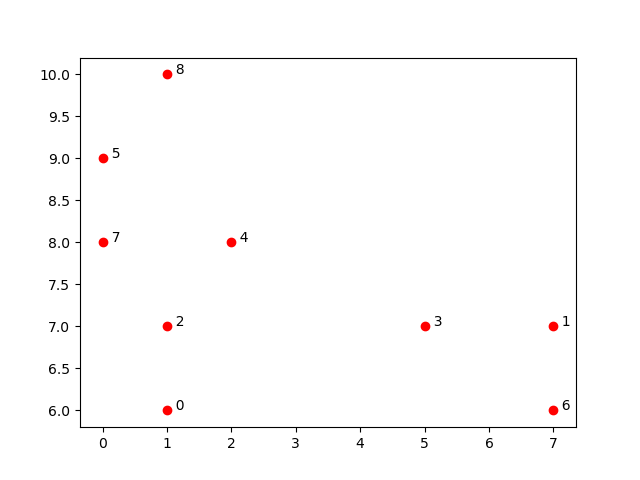
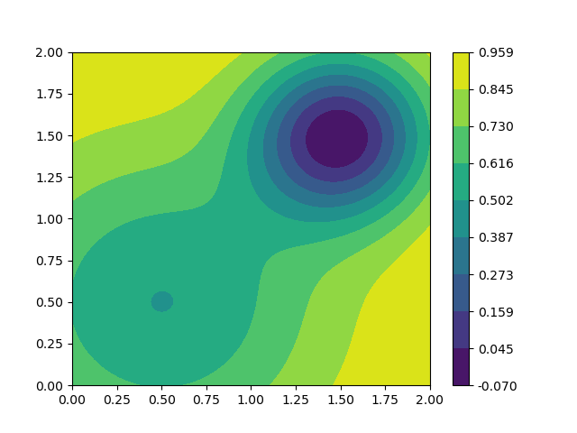

# 2023-BD_ML_AI自救笔记
##### 这个笔记旨在用互助的方式帮助可怜的能动孩子理解Noack教授的课堂内容
---
## Lecture 1 
### Proximity map
#### 简要介绍(临近图)
对于高维空间的中的数据点（例如xyz坐标中的一个点），要想映射到低维空间（xy坐标系），需要通过数据降维，一些降维方法保留了中心点与临近点之间的相对关系，使得高位空间的部分信息能够在低维空间中得以体现，这样在低维空间中画出来的图便是Proximity map(临近图)
### Locally linear embedding(局部线性插值)
#### 内容参考

[[BiliBili] python与人工智能-数据降维-LLE](https://www.bilibili.com/video/BV14g411F7Je/?spm_id_from=333.337.search-card.all.click&vd_source=35bbad48bf3d84d0d268e71078d2cf2e)
  
#### 简要介绍
**"Locally Linear Embedding"** 下面简称 **LLE** 是一种实现数据降维的方法。简单来说，对于一个高维空间的数据点，映射到低维空间中时，要想保持与其他点相对位置的一致性，**可以使用LLE方法**,如下图所示：
  

  
<center> LLE原理</center>

#### 具体实现
如上图，将高维空间的一个点 $X_i$ 映射到低维空间中（ $X_i$ 可以看成一个向量，其中的每一个元素可以看成 $X_i$ 的属性），可以选取 $X_i$ 周围的的点（临近点 $X_j$ ），计算出临近点与中心点 $X_i$的相对为位置关系（即 $W_{ij}$ , 表示 $X_i$ 与 $X_j$ 之间的位置关系），在映射的时候，保证 $X_i$的映射对应点 $Y_i$ 与周围的临近点 $Y_j$ 保持类似的位置关系（ $W_{ij}$ ）就可以了。

1.构造函数，求解中心点与临近点之间的位置关系:
  


>ps.其中 $\underset{min}{arg}(w_i)$表示使等号后式子最大时得到 $w_i$的值， $X_i \in [1, D]$表示 $X_i的大小为1 \times D$,  $I_{k \times i}$为全1向量
    
2.通过代数方法使函数最小，求得相对位置关系 $w_{i}$


ps.拉格朗日乘数法：设给定二元函数 $z=f(x,y)$ 和附加条件 $\varphi(x,y)=0$ 
为寻找 $z=f(x,y)$ 在附加条件下的极值点，先做拉格朗日函数
$F(x,y,\lambda)=f(x,y)+\lambda \varphi (x,y)$ ，其中 $\lambda$ 为参数。
令 $F(x,y,\lambda)$ 对 x 和 y 和 $\lambda$ 的一阶偏导数等于零，即

$$ F'_x=f'_x(x,y)+\lambda\varphi'_x(x,y)=0 $$

$$ F'_y=f'_y(x,y)+\lambda\varphi'_y(x,y)=0 $$

$$ F'_\lambda=\varphi (x,y)=0 $$

由上述方程组解出 x，y 及 $\lambda$ ，如此求得的 $(x,y)$，就是函数 $z=f(x,y)$ 在附加条件$\varphi (x,y)=0$ 下的可能极值点。
若这样的点只有一个，由实际问题可直接确定此即所求的点。

3.低维空间重映射


>ps.对于为何可以用矩阵的迹代替原式子，我还没有答案，期望有同学帮忙解答。


这样，我们得到了 $X_i$降维后的映射点 $Y_i$,LLE也就完成了！~~补线性代数去了~~

### The Proper Orthogonal Decomposition(POD)

This is an explaination for note.py, the idea is got from https://youtu.be/TcqBbtWTcIc?si=fw05Dq5k5amXK66s.and https://youtu.be/axfUYYNd-4Y?si=iX0Itx-csr0uVOyU.
Our teacher has taught the lecture at https://youtu.be/SGOf8ST0nfo?si=8BP7n6Hbwdb_Tv7V.

Suppose we have data that is a fuction of both space and time.
$$y(x,t) = \sum_{m}^{j=1}u_{j}(x)a_{j}(t)$$

Obviously, we can not deal with it easily. If we wanna:
1. to understand the pertinent features present in the data;
2. to store/represent/manipulate the data;
3. to build a reduced-complexity model for the dynamics.

Now, we collect both spatial location and times sets:

$$ x: x_{1}, x_{2}, x_{3},..., x_{n}. $$

$$ t: t_{1}, t_{2}, t_{3},..., t_{m}. $$

We can assemble the data $y(x,t)$ into an $m$ x $n$ matrix:

$$
Y = \begin{bmatrix}
 y(x_{1},t_{1}) & y(x_{1},t_{2}) & \dots  & y(x_{1},t_{m})\\
 y(x_{1},t_{1}) & y(x_{1},t_{2}) & \dots & y(x_{2},t_{m})\\
\vdots  & \vdots  & \ddots & \vdots \\
 y(x_{n},t_{1}) & y(x_{n},t_{2}) & \dots & y(x_{n},t_{m})
\end{bmatrix}
$$

If we measure two components of velocity, $u$ and $v$, the matrix changes as follows:

$$
Y = \begin{bmatrix}
 u(x_{1},t_{1}) & u(x_{1},t_{2}) & \dots & u(x_{1},t_{m})\\
 u(x_{1},t_{1}) & u(x_{1},t_{2}) & \dots & u(x_{2},t_{m})\\
\vdots  & \vdots  & \ddots & \vdots \\
 u(x_{n},t_{1}) & v(x_{n},t_{2}) & \dots & v(x_{n},t_{m})\\
 v(x_{1},t_{1}) & v(x_{1},t_{2}) & \dots & v(x_{1},t_{m})\\
 v(x_{1},t_{1}) & v(x_{1},t_{2}) & \dots & v(x_{2},t_{m})\\
\vdots  & \vdots  & \ddots & \vdots \\
 v(x_{n},t_{1}) & v(x_{n},t_{2}) & \dots & v(x_{n},t_{m})
\end{bmatrix}
$$

If we can use a vector on the left which is only going to be a fuction of space and a vector on right which is only going to be a fuction of time, then the purpose that we wanna get may make sense. Just like the figure as follows.


This can be achieved through a Singular Value Decomposition(SVD):
$$Y = U \Sigma V^{*}$$


Through a code example, it will help us understand better.

```Python
import numpy as np
from numpy import linalg
import matplotlib as mpl
from matplotlib import pyplot as plt

#Define data
x = np.linspace(-2,2,401)
Nx = np.size(x)

amp1 = 1
x01 = 0.5
sigmay1 = 0.6

amp2 = 1.2
x02 = -0.5
sigmay2 = 0.3

dt = 0.01
Nt = 1001
tend = dt*(Nt-1)
t = np.linspace(0,tend,Nt) #time

omega1 = 1.3
omega2 = 4.1

y1 = amp1*np.exp(-((x-x01)**2)/((2*sigmay1**2)))
y2 = amp2*np.exp(-((x-x02)**2)/((2*sigmay2**2)))

Y = np.zeros([Nx,Nt],dtype='d')
for tt in range(Nt):
    Y[:,tt] = y1*np.sin(2*np.pi*omega1*t[tt]) + y2*np.sin(2*np.pi*omega2*t[tt])
U, S, VT = linalg.svd(Y, full_matrices= False)
```

Then we finish the data initialization, and show the data set as follows.

```Python
# show y1 and y2
plt.plot(x,y1,label='y1')
plt.plot(x,y2,label='y2')
plt.xlabel('x', fontsize=18)
plt.ylabel('y', fontsize=18)
plt.legend()
plt.show()
```


```Python
#plt all data
Tgrid, Ygrid = np.meshgrid(t,x)

#contour
plt.contour(Ygrid, Tgrid, np.abs(Y))
plt.xlabel('x', fontsize=18)
plt.ylabel('time', fontsize=18)
plt.ylim(0,4)
plt.show()
```

```Python
plt.semilogy(S,'-o')
plt.xlim(0,10)
plt.ylabel('Singular Value', fontsize=18)
plt.xlabel('Index', fontsize=18)
plt.show()
```


The diagonal matrix is the energy matrix $\Sigma$. Each diagonal element of this matrix is related to the amplitude of corresponding mode. From the figure below, we can find that only the first modes hold the most energy. The higher modes have less energy.


```Python
# x, U
plt.plot(x,U[:,0],label='U1')
plt.plot(x,U[:,1],label='U2')
plt.xlabel('x', fontsize=18)
plt.ylabel('U', fontsize=18)
plt.title('POD modes', fontsize=18)
plt.legend()
plt.show()
```


Each column of this matrix($U$) is a mode or a vector which is for our set of simulation snapshots can be unpack into a picture of the same size of original snapshots. Each one is a spatial mode constructed with the underlying data. The first mode is just the average of this data set. The first few modes should give us a pretty good approximation of the underlying data set.


```Python
# t,VT
plt.plot(t,VT[0,:],label='VT1')
plt.plot(t,VT[1,:],label='VT2')
plt.xlim(0,4)
plt.xlabel('time', fontsize=18)
plt.ylabel('VT', fontsize=18)
plt.title('mode coefficients', fontsize=18)
plt.legend()
plt.show()
```


The finally matrix contain the time coefficients for each mode, if the underlying data is organized as snapshots in time.


In conclusion, there is a simple sine wave to produce our matrix. We know that a traveling sine wave can be successfully generated by a pair of two stationary sinusoids that are all of phase this just comes from an elementary trigonometric relationship.


If we perform the POD algorithm in this data set, we can get many modes. But only two modes can perform meaningful amount of energy, which can be seen in the $\Sigma$ matrix. Meanwhlie, if we multiply the $U$ and the $\Sigma$ matrix, then we get an energy wight mode matrix that contain the spatial functions that reconstruct the data.


Now we look at the first two modes that have no negligible energy. It could be seen like the cosine of minus kx and the sine of minus kx functions be multiplied by the corresponding time, which would produce the original traveling wave from the data.


Through matrix operations, we can also get some interesting things.


It is useful to find the relationships between phenomena in your data set. For example, the small disturbance in this region is causing a large disturbance in the before region in this airfoil trading edge.


Besides, we can use it in a plenty kinds of situation like figures as follows. 


### Dynamic Mode Decomposition

The original website is https://youtu.be/xAYimi7x4Lc?si=f-yYdvbor_Mccq8H and https://www.youtube.com/watch?v=lx-msllg1kU. You can watch it by yourself. This is something comprehended by myself.
And the references are https://arxiv.org/pdf/2112.04307.pdf, https://epubs.siam.org/doi/pdf/10.1137/15M1013857.

Dynamic mode decomposition (DMD) is a powerful data-driven method for analyzing complex systems. Using measurement data from numerical simulations or laboratory experiments, DMD attempts to extract important dynamic characteristics such as unstable growth modes, resonance, and spectral properties. This section provides the mathematical background of DMD.


This is the summary of Dynamic Mode Decomposition(DMD). 

To begin with data collecttion and organization, at a fundamental level, DMD analyzes the relationship between pairs of measurements from a dynamical system.The measurements, $\mathbf{x_{k}}$ and $\mathbf{x_{k+1}}$, where $k$ indicates the temporal iteration from a discrete dynamical system, are assumed to be approximately related by a linear operator:

$$
\mathbf{x_{k+1}} \approx  \mathbf{A}\mathbf{x_k},
$$

where $\mathbf{x} ∈ \mathbb{R}^{n}$ and $\mathbf{A} ∈ \mathbb{R}^{n \times n}$. This approximation is assumed to hold for all pairs of measurements. The subsequent description and discussion of DMD will be centered around finding a best-fit solution of the operator A for all pairs of measurements.

Now, we denote the sequence of snapshots collected by the following description:

$$
\mathbf{X} = \begin{bmatrix}
\mid & \mid &  & \mid \\
\mathbf{x_1} & \mathbf{x_2} & \dots  &\mathbf{x_{m-1}} \\
\mid & \mid &  & \mid 
\end{bmatrix}, 
$$

$$
\mathbf{X'} = \begin{bmatrix}
\mid & \mid &  & \mid \\
\mathbf{x_2} & \mathbf{x_3} & \dots  &\mathbf{x_{m}} \\
\mid & \mid &  & \mid 
\end{bmatrix}, 
$$

where $m$ is the total number of snapshots and $\mathbf{X'}$ is the time-shifted snapshot matrix of $\mathbf{X}$, i.e., $\mathbf{X'} = \mathbf{A}\mathbf{X}$. The relationship between pairs of measurement in and the combined data snapshots can be described more compactly in the following matrix form:

$$
\mathbf{X'} \approx \mathbf{A}\mathbf{X},
$$

Solving for an approximation of the process matrix $\mathbf{A}$ for the measurement matrix pair $\mathbf{X}$ and $\mathbf{X'}$ is the primary objective of DMD.

The following section describes how to find the dynamic modes and eigenvalues of the underlying system $\mathbf{A}$. The DMD of the measurement matrix pair $\mathbf{X}$ and $\mathbf{X'}$ is the eigendecomposition of the matrix $\mathbf{A}$. The operator $\mathbf{A}$ is defined by the following:

$$
\mathbf{A} = \mathbf{X'} \mathbf{X}^{-1}
$$

A computationally efficient and accurate method for finding the pseudoinverse is via the SVD. The SVD of $\mathbf{X}$ results in the well-known decomposition.

$$
\begin{aligned}
\mathbf{X} = \mathbf{U} \boldsymbol{\Sigma} \mathbf{V}^{\ast} & =\left[\begin{array}{cc}
\tilde{\mathbf{U}} & \tilde{\mathbf{U}}_{\mathrm{rem}}
\end{array}\right]\left[\begin{array}{cc}
\tilde{\boldsymbol{\Sigma}} & 0 \\
0 & \boldsymbol{\Sigma}\_{\mathrm{rem}}
\end{array}\right]\left[\begin{array}{c}
\tilde{\mathbf{V}}^{\ast} \\
\tilde{\mathbf{V}}\_{\mathrm{rem}}^{\ast}
\end{array}\right] \\
& \approx \tilde{\mathbf{U}} \tilde{\boldsymbol{\Sigma}} \tilde{\mathbf{V}}^{\ast}
\end{aligned}
$$

where $\mathbf{U} \in \mathbb{R}^{n \times n}$, $\boldsymbol{\Sigma} \in \mathbb{R}^{n \times m-1}$, $\tilde{\mathbf{V}}^{\ast} \in \mathbb{R}^{m-1 \times m-1}$, $\tilde{\mathbf{U}} \in \mathbb{R}^{n \times r}$, $\tilde{\boldsymbol{\Sigma}} \in \mathbb{R}^{r \times r}$, $\tilde{\mathbf{V}}^{\ast} \in \mathbb{R}^{r \times m-1}$ , rem indicates the remaining $m-1-r$ singular values, and ${ }^{\ast}$ denotes the complex conjugate transpose.

Using the SVD of the snapshot matrix $\mathbf{X}$, the following approximation of the matrix $\mathbf{A}$ can be computed:

$$
\mathbf{A} \approx \mathbf{\bar{A}} = \mathbf{X'}\tilde{\mathbf{V}} \tilde{\boldsymbol{\Sigma}}^{-1} \tilde{\mathbf{U}}^{\ast}
$$

where $\mathbf{\bar{A}}$ is an approximation of the operator $\mathbf{A}$. $\mathbf{A}$ dynamic model of the process can be constructed given by the following:

$$
\mathbf{x}\_{k+1} =\mathbf{\bar{A}} \mathbf{x}_{k}
$$

If $r \ll n$, a more compact and computationally efficient model can be found by projecting $\mathbf{x_k}$ onto a linear subspace of dimension $r$. This basis transformation takes the form $\mathbf{P}\mathbf{x} = \tilde{\mathbf{x}}$. As previously shown by DMD, a convenient transformation has already been computed via the SVD of $\mathbf{X}$, given by $\mathbf{P} = \tilde{\mathbf{U}}_{*}$. The reduced-order model can be derived as follows:

$$
\begin{aligned}
\tilde{\mathbf{x}}\_{k+1} & =\tilde{\mathbf{U}}^{\ast} \overline{\mathbf{A}} \tilde{\mathbf{U}} \tilde{\mathbf{x}}\_{k} \\
& =\tilde{\mathbf{U}}^{\ast} \mathbf{X}^{\prime} \tilde{\mathbf{V}} \tilde{\mathbf{\Sigma}}^{-1} \tilde{\mathbf{x}}\_{k} \\
& =\tilde{\mathbf{A}} \tilde{\mathbf{x}}_{k}
\end{aligned}
$$

The reduced-order model is given by the following:

$$
\tilde{\mathbf{A}} = \tilde{\mathbf{U}}^{\ast} \mathbf{X}^{\prime} \tilde{\mathbf{V}} \tilde{\mathbf{\Sigma}}^{-1}
$$


As for regression, it is another way to understand the DMD that it seeks a low rank matrix that represent the data. In fact, it can be thought to be a minimization problem, which means that we don't need to understand every single element in matrix A but just the elements in this two column and two rows. Besides, we can improve the memory efficient and do fast computations by the low matrix. ($\mathbf{Y}$ is equal to $\mathbf{X'}$)

$$ \mathbf{A} = \underset{rank(\mathbf{A})\le r}{\arg\min}||\mathbf{Y}-\mathbf{A}\mathbf{X}||_{F} $$


## Lecture 2 (聚类算法)
人以类聚，物以群分。聚集与分类彼此关联，越是聚集的事物往往可分为共同的类别；同一类的事物，往往集聚在一起。聚类算法便是一类帮助我们通过聚集情况分辨类别的算法。
### Kmeans（K均值聚类）
#### 内容参考
[知乎:机器学习（一）Kmeans算法+简单可视化展示](https://zhuanlan.zhihu.com/p/48340404)

#### 简单介绍
在数学与现实的交会中，点不仅仅代表空间中的一个坐标，而还可以代表一个对象的特征。例如对于一个班级来说，每一个学生都可以用身高和体重来描述他（她）的身体特征；那么我们便可以用 **（身高， 体重）** 作为二维空间中的一个点来代表一个学生的身体特征。当然对于身体特征的总体情况，我们可以用一些代表某一类型的词来描述，例如“胖子”，“瘦子”。

那么，我们该如何在班级中划定“胖子”，“瘦子”的类别呢？我们先前说了，二维平面中的点 **（身高， 体重）** 可以用来描述一个学生身体特征， 则点越聚集，则这些点代表的学生身体特征越相近。点的聚集情况可以用点之间的距离来判定，距离越小，关系越密。那么便可以通过点的聚集情况划分"胖瘦"，将某一个集群划分为“胖子”，“瘦子”，根据距离来判别聚集情况，进而划分类别，这种算法便是Kmeans。
#### 具体原理
要想如何实现我们上述的构思呢。首先我们得先明确距离是什么。对于我们一般研究的空间，我们可以用欧氏距离描述两点之间的距离，即


有了距离，我们便可以用距离的大小来描述聚类集群之间的紧密程度，那么我们只要将点归类为离它最近的聚类集群就好了。

一个简单的想法便是：
1. 选取k个点作为k个类别的代表，称为聚类中心(centriods)。
2. 对每一个点计算其与这k个聚类中心之间的距离。
3. 将每个点归类到与之最近（距离最小）的聚类中心所代表的类别中。

放在刚才的班级的例子中，就是在班级中选取两名同学作为“胖子”，“瘦子”的代表，然后让每名同学与之比较，与“胖子”代表身材相近的归类为“胖子”，与“瘦子”代表身材相近的归类为“瘦子”。

当然上述想法并不能真正实现准确的聚类，一个显而易见的问题是我们该如何选取类别代表。判断“胖瘦”的代表性是个很主观的意见，人很难判断，计算机更是无从判别。而不同的代表的选取，最终的结果可能天差地别，分类的效果也不尽人意。

拿刚才的例子来说，我们选出的“胖子”代表可能并不胖，班级中的大部分人反而因此被归类为“胖子”，而只有少部分人跟更瘦的“瘦子”代表相近而被归类为“瘦子”，结果“胖子”的数量远超“瘦子”，而从总体看来真正胖的人并不多，最终的结果可能不令人满意。

要解决这一问题，我们得重新思考该选用何种标准作为一个类别（集群）特征的代表。从统计学的角度来看，要想描述一种特征的一般情况（例如身高，体重），我们往往选用平均数来描述。而对于二维平面乃至更高维度中的点（多种特征）来说，这便是质心。那么，我们便想到可以用平均值（质心）来代替刚才所说的代表作为聚类中心，利用迭代的方式求取质心来更新聚类中心，便可很好的解决刚才的问题。

新的想法如下：
1. 选取k个点作为称为聚类中心(centriods)。
2. 对每一个点计算其与这k个聚类中心之间的距离。
3. 将每个点归类到与之最近（距离最小）的聚类中心所代表的类别中。
4. 计算每个类别集群中点的质心，将该集群的聚类中心修改为质心所在的点
5. 重复步骤2~4，直到每个点所属的类别不再改变。

又从班级的例子来说，虽然我们一开始选择的“胖子”代表不够胖，但是在第一次划分类别后，我们以每一个类别的平均情况作为新的代表来参照，那么一些没那么胖的人便会与“胖子”的平均情况相差甚远，在下一次划分类别时被归类为“瘦子”，如此重复几次，当所有人的分类稳定后，聚类也就完成了，结果也比刚才的方法更好。


#### 计算机实现
上述方法在计算机中也是可以实现的，我们在python中实现了这一算法，下面我们将逐一讲解代码，结合可视化帮助大家理解这一过程。

##### 创造数据集
``` python
import numpy as np
import matplotlib.pyplot as plt
import random
from matplotlib.animation import FuncAnimation
from matplotlib.animation import ArtistAnimation
#构造数据
def creat_data(n = 5, size = 10, zoom = 100):
    data = []
    #在[0. 100] 的空间中随机创造n个集群
    for i in range(n):
        x_ini = np.random.randint(0, zoom, 1)
        y_ini = np.random.randint(0, zoom, 1)
        # print(x_ini, y_ini)
        x = np.random.randint(x_ini, x_ini + size, size = size)
        y = np.random.randint(y_ini, y_ini + size, size = size)
        data = np.append(np.array([x, y]).T, data)
    data = data.reshape(n * size, -1)
    #打乱数据
    np.random.shuffle(data)
    print(data)
    #绘制初始图像
    plt.scatter(data[:, 0], data[:, 1], c = 'r')
    for i in range(n * size):
        plt.annotate('  ' + str(i), (data[i, 0], data[i, 1]), fontsize=10)
    plt.show()
    plt.close()
    return data
```
这里选择构造n=3个集群，范围zoom=10，数据点绘制结果如下


然后，我们随机选取k = n_clusters = 3个点作为初始聚类中心。
``` python
def MyKmeans(data, n_clusters = 3):
    
    N, col = data.shape
    #分类变量，记录其所属及集群
    category = np.zeros(N, dtype=int)
    #聚类中心坐标
    centroids = np.zeros((n_clusters, 2))
    #随机取初始聚类中心，保存行标签
    cen_index = random.sample(range(N), n_clusters)
    #更新聚类中心坐标
    for i in range(n_clusters):
        centroids[i] = data[cen_index[i]]
        category[cen_index[i]] = i
    #可视化
    fig = plt.figure()
    ax = fig.subplots()
    ax.scatter(data[:, 0], data[:, 1], c = category)
    ax.scatter(centroids[:, 0], centroids[:, 1], marker='+', s = 200, c = 'r')
    for i in range(N):
        plt.annotate('  ' + str(i), (data[i, 0], data[i, 1]), fontsize=10)
    plt.pause(5)
    ax.cla()
```
可视化结果如下。

红+代表聚类中心的位置，点的颜色代表每个点的所属类别，这里选取0， 2， 6号点作为初始聚类中心。

然后通过质心更新聚类中心的位置，重新划分点带类别，不断迭代，直到结果稳定。

``` python
   #定义Kmeans结束flag
    flag = True
    while(flag):
        flag = False
        #遍历所有数据点
        for i in range(N):
            #计算获取距离数据点最近的聚类中心
            cen_min = 0
            min_dist = np.sqrt(np.sum((data[i] - centroids[0])**2))
            for j in range(n_clusters):
                dist = np.sqrt(np.sum((data[i] - centroids[j])**2))
                if(dist < min_dist):
                    cen_min = j
                    min_dist = dist
            #如果该点的所属集群改变，则继续Kmeans，如果所有点的所属集群未改变则停止Kmeans
            if (category[i] != cen_min):
                flag = True
                category[i] = cen_min
                # ax.scatter(data[:, 0], data[:, 1], c = category)
                # ax.scatter(centroids[:, 0], centroids[:, 1], marker='+', s = 200, c = 'r')
                # plt.pause(5)
                # ax.cla()
        #更新聚类中心到每个集群的质心


        for j in range(n_clusters):
            new_centroids = np.mean(data[(category == j)], axis = 0) #(category == j) 筛选出属于j集群的所有数据点， 然后求均值
            centroids[j] = new_centroids
        #可视化
        ax.scatter(data[:, 0], data[:, 1], c = category)
        ax.scatter(centroids[:, 0], centroids[:, 1], marker='+', s = 200, c = 'r')
        for i in range(N):
            plt.annotate('  ' + str(i), (data[i, 0], data[i, 1]), fontsize=10)
        plt.pause(5)
        ax.cla()
    #返回分类结果
    return category
```
可视化每次迭代结果，如下下图所示：
* 第一次迭代，由于1， 3号点与绿色的聚类中心比较近，所以被重新划分为绿色类别。

* 第二次迭代，由于2号点远离了紫色的聚类中心，反而与黄色的聚类中心相近了。被划分为黄色类别。

* 第三次迭代，发现与上一次迭代结果没有区别，迭代结束


输出分类结果

``` python
if(__name__ == '__main__'):
    
    #定义初参
    n_clusters = 3
    data =  creat_data(n = n_clusters, size = 3, zoom = 10)
    category = MyKmeans(data, n_clusters = n_clusters)
    
    print(category)
```
Output: [2 1 2 1 0 0 1 0 0 ]

当然python的sklearn库也集成了Kmeans的方法，简单调库也可以实现Kmeans.

``` python
from sklearn.cluster import KMeans

.....

# 设置Kmeans算法参数
clf = KMeans(n_clusters=n_clusters) 
# 模型拟合输入数据，输出分类结果
category = clf.fit_predict(num)

.....
```

最后，感谢PD同学提供的Exercise 3 for Kmeans 的代码，给大家提供完整的实例

``` python
import numpy as np
from scipy.integrate import odeint
import matplotlib.pyplot as plt
import sklearn as skl
from sklearn.cluster import KMeans
from sklearn.datasets import make_blobs
from sklearn.metrics import silhouette_score

def Lorenz(y0, t, para=[10,28,8/3]):
    p, r, b = para
    x, y, z = y0
    dx = -p*(x-y)
    dy = r*x-y-x*z
    dz = -b*z+x*y
    return np.array([dx,dy,dz])

t = np.arange(-100, 100, 0.01)
y0 = [1,2,3]
sol = odeint(Lorenz,y0,t,args=([10,20,8/3],)) 

plt.figure()
plt.axes(projection='3d')
plt.plot(sol[:, 0], sol[:, 1], sol[:, 2])
plt.title('Lorenz')
plt.show()

# x = np.around(sol)
x = sol.copy()

# X = np.reshape(x,[x.shape[0],-1])
X = x[10000:]

n_clusters=8
cly = KMeans(n_clusters=n_clusters,random_state=0)
cluster = cly.fit_predict(X)
print(cluster)

centroid=cly.cluster_centers_

plt.figure()
plt.axes(projection='3d')
plt.scatter(centroid[:, 0], centroid[:, 1], centroid[:, 2], c = 'r')
# plt.plot(sol[:, 0], sol[:, 1], sol[:, 2])
plt.scatter(X[:, 0],X[:, 1], X[:, 2], c = cluster, alpha=0.1)
plt.title('Lorenz')
plt.show()
```

## Lecture 3 变分问题
### downhill simplex method
The Nelder–Mead method (also downhill simplex method, amoeba method, or polytope method) is a numerical method used to find the minimum or maximum of an objective function in a multidimensional space. It is a direct search method (based on function comparison) and is often applied to nonlinear optimization problems for which derivatives may not be known. However, the Nelder–Mead technique is a heuristic search method that can converge to non-stationary points on problems that can be solved by alternative methods.

The Nelder–Mead technique was proposed by John Nelder and Roger Mead in 1965, as a development of the method of Spendley et al.


#### One possible variation of the NM algorithm
We are trying to minimize the function $f({\mathbf  x})$, where ${\displaystyle \mathbf {x} \in \mathbb {R} ^{n}}$. Our current test points are ${\displaystyle \mathbf {x} _{1},\ldots ,\mathbf {x} _{n+1}}.$

##### step1:Order 
according to the values at the vertices: ${\displaystyle f(\mathbf {x} _{1})\leq f(\mathbf {x} _{2})\leq \cdots \leq f(\mathbf {x} _{n+1}).}$
Check whether method should stop. See Termination (sometimes called "convergence").

##### step2:Calculate 
${\displaystyle \mathbf {x} _{o}}$, the centroid of all points except ${\displaystyle \mathbf {x} _{n+1}}.$

##### step3:Reflection
Compute reflected point ${\displaystyle \mathbf {x} _{r}=\mathbf {x} _{o}+\alpha (\mathbf {x} _{o}-\mathbf {x} _{n+1})}$ with $\alpha >0.$
If the reflected point is better than the second worst, but not better than the best, i.e. $f(\mathbf{x_1})\le f(\mathbf{x_r}) < f(\mathbf{x_n})$ then obtain a new simplex by replacing the worst point ${ \mathbf {x} _{n+1}}$ with the reflected point ${\mathbf {x} _{r}}$ and go to step 1.

##### step4:Expansion
If the reflected point is the best point so far, $f(\mathbf{x_r}) < f(\mathbf{x_1})$, then compute the expanded point $\mathbf{x_e}=\mathbf{x_o}+\gamma (\mathbf{x_r}-\mathbf{x_o})$ with $\gamma >1$.
If the expanded point is better than the reflected point, $f(\mathbf{x_e}) < f(\mathbf{x_r})$,then obtain a new simplex by replacing the worst point $\mathbf {x_n+1}$ with the expanded point $\mathbf {x_e}$ and go to step 1;
else obtain a new simplex by replacing the worst point $\mathbf{x_{n+1}}$ with the reflected point $\mathbf{x_r}$ and go to step 1.

##### step5:Contraction
Here it is certain that $f(\mathbf{x_r}) \ge f(\mathbf{x_n})$. (Note that $\mathbf{x_n}$ is second or "next" to the worst point.)
If $f(\mathbf{x_r}) < f(\mathbf{x_{n+1}})$, then compute the contracted point on the outside ${\displaystyle \mathbf {x_c}=\mathbf{x_o}+\rho (\mathbf{x_r}-\mathbf{x_o})}$ with ${\displaystyle 0<\rho \leq 0.5}.$ 
If the contracted point is better than the reflected point, i.e. ${\displaystyle f(\mathbf{x_c}) < f(\mathbf{x_r})},$ then obtain a new simplex by replacing the worst point $\mathbf{x_{n+1}}$ with the contracted point $\mathbf{x_c}$ and go to step 1;
Else go to step 6;
If $f(\mathbf{x_r}) \geq f(\mathbf{x_{n+1}}),$ then compute the contracted point on the inside ${\displaystyle \mathbf{x_c}=\mathbf {x_o}+\rho (\mathbf{x_{n+1}}-\mathbf{x_o})}$ with ${\displaystyle 0<\rho \leq 0.5}.$
If the contracted point is better than the worst point, i.e. 
$f(\mathbf {x_c}) < f(\mathbf {x_{n+1}})$,
then obtain a new simplex by replacing the worst point ${\displaystyle \mathbf {x} _{n+1}}$ with the contracted point ${\displaystyle \mathbf {x} _{c}}$ and go to step 1;
Else go to step 6;

##### step6:Shrink
Replace all points except the best $({\displaystyle \mathbf {x} _{1}})$ with ${\displaystyle \mathbf {x} _{i}=\mathbf {x} _{1}+\sigma (\mathbf {x} _{i}-\mathbf {x} _{1})}$ and go to step 1.

Note: $\alpha$, $\gamma$, $\rho$ and $\sigma$  are respectively the reflection, expansion, contraction and shrink coefficients. Standard values are $\alpha =1$, $\gamma = 2$, ${\displaystyle \rho =1/2}$ and ${\displaystyle \sigma =1/2}.$

Like:


To:


### Genetic Algorithm (遗传算法)
#### 内容参考
[CSDN:遗传算法详解 附python代码实现](https://blog.csdn.net/ha_ha_ha233/article/details/91364937?ops_request_misc=%257B%2522request%255Fid%2522%253A%2522169595461716777224438773%2522%252C%2522scm%2522%253A%252220140713.130102334..%2522%257D&request_id=169595461716777224438773&biz_id=0&utm_medium=distribute.pc_search_result.none-task-blog-2~all~top_positive~default-2-91364937-null-null.142^v94^chatsearchT3_1&utm_term=%E9%81%97%E4%BC%A0%E7%AE%97%E6%B3%95&spm=1018.2226.3001.4187)
#### 简单介绍
对于一个变分问题（即求解泛函的最大最小值），当不使用计算机时，我们第一时间想到的便是求导求解最值（如拉格朗日乘数法等）。但是，有些函数使用数学方法求解最值过于复杂，有了计算机的帮助后，我们便可以摆脱这些数学技巧，利用计算机通过一些简单重复的步骤便可获取答案。

试想当我们完全不知道有关函数求导的知识，对于一个多元函数（例如 $f(x, y)$ ）在给定范围下求解函数的最值，我们该如何求解这样的问题呢。 一个朴素的想法是我们可以拿一些自变量的值去尝试，事实上，只要我们所尝试的值足够多，总能找到一个答案与最值的误差在一定范围内。计算机便可以帮助我们做这样的事。对于给定求解最值的空间中，利用计算机均匀地划分足够多的采样点，求解这些采样点所对应的函数值，我们便可以得到一个最值的近似值。
例如对Exercise 6， 我们也可以通过均与采样的方式来求取最值。

.png)

虽然计算机可以很好的帮助我们做大量的重复的计算工作，但是这种方法还是存在不少的弊端。首先便是取样的问题，为了获得足够精确的结果，我们划分的采样点不得不足够多，足够密集，但是这样会造成大量的计算任务，对于复杂的函数来说，计算机的效率可能就显得不够高了。

遗传算法为了解决这个问题，参考了生物界中 **“物竞天择，适者生存”** 的原理，模仿自然选择的过程，通过不断迭代淘汰掉差采样点，留下更优的采样点，并且通过一定的手段保留这种优势，让采样点不断的寻优，从而得到我们想要的结果。
#### 具体原理
遗传算法大概分为一下几个操作和步骤
##### 种群与个体
遗传算法是模仿生物界中自然选择原理建立的，自然也集成了生物学中的一些观点，种群与个体便是其中之一。在此算法中，个体事我们需要计算寻优的对象，种群则是这些对象组成的集合。在上面的例子中，个体便是我们选取的采样点，种群便是我们选取的采样点的集合。
##### 基因
为了实现这个算法，我们需要定义基因。这里的基因一般是一串数组，方便我们实现杂交编译等操作。同时，基因需要记录个体的一些信息。在上述变分问题的例子中，我们需要用基因来记录每一个采样点的位置信息（即 **(x, y)**），从而帮助我们计算采样点的函数值。为了让后续的杂交编译的操作更加便捷有效，我们使用二进制来保存我们的基因。

举个例子，对于基因 **[1, 0, 1, 1, 0, 1]** 来说什么，它该如何翻译成我们所需要的坐标信息呢。下图展现了基因翻译的过程。


具体简单来说做法便是
1.将基因按照奇偶分为两个部分，分别对应x, y的值
2.将二进制的x，y的值化成十进制。
3.构造映射将x，y映射到所需的范围中去。
事实上，这样的作法就是将求解区域划分成 $2^N \times 2^N$ 的网格，让每一个节点与唯一的一条二进制基因序列对应。这样问题变被我们转化成了寻找最优的（函数值最大或最小）基因序列。
当然，也可像下图划分x，y。

.png)

##### 选择操作(selection)
选择操作可以说是遗传算法最为核心的部分了，参考自然界中的自然选择原理，让更优的个体留存产生后代，从而优化种群实现寻优。

如何认定子代的优劣呢，这里我们先定义每一个个体的适应度。

$$for \ maxF_i :\ \   fitness(i) = F_i - F_{min} 
\\  for \ minF_i :\ \   fitness(i) = F_{max} - F_i $$

适应度的定义并复杂，本质上是根据优化目标，让种群的函数值移动到以0为起点。保证最差的个体（距离优化目标最远的采样点）适应度为0。
然后根据适应度定义每个个体被选择迭代（产生后代）的概率。

$$ P_i = \frac{fitness(i)}{\sum_{pop}{fitness(j)}} $$

根据这一定义，适应度愈大的个体被选中的概率最大，而最差的个体由于适应度为0，不存在被选中的机会。引入适应度，让选择更大的偏向函数值更符合期望的个体，防止函数值本身差异不大而影响选择的进行。
##### 杂交与变异操作
杂交和变异操作让子代与父代之间产生变化，放在刚才的例子来说就是采样点的移动，这样的变化配合选择操作可以让子代个体总体上向着更优解迈进，于此同时，适当的变化可以让子代跳出一些局部最优的情况，从而达到全局最优解。

**杂交(crossover)**,顾名思义，就是子代获得父本母本的各一部分基因，重新组合，如下图所示。


上图选取的杂交点是随机选取的，当然除了上图所示的单点杂交操作外，还可以选择多个杂交点，互换父母多段基因片段，这里不多赘述。

**变异(mutation)**,顾名思义，就是改变子代的一些基因片段，使其与父母展现出不同的特征，如下图所示。


当然，出了上图所示的变异方式，还有其他的变异方式（改变多个基因片段，或者互换前后两个基因片段的顺序），这里不再赘述。

##### 迭代
遗传算法就是通过选择，杂交与变异更新种群，通过反复重复这一过程使得种群变得更优，实现优化目的。每一次迭代，按照如下图所示的方式进行。


这里我们需要确定算法的杂交概率($P_1$)和变异概率($P_2$),这些参数能够帮助我们调控算法的性能。从上图可知，从父代产生子代的每一条路径都有一定的概率而且只能通过其中一条路径产生。子代个体数与选择的父代个体数相同，从而保证种群里个体的数量稳定，不会出现种群的暴增或消失。

##### 求解
我们可以设置算法的迭代次数n，在迭代完成后，计算最后一代种群中函数值的最优值作为算法的结果。

#### 计算机实现
以exercise 6为例，python实现如下：
##### 相关参数设置
```python
import numpy as np
import matplotlib.pyplot as plt
from matplotlib import cm
from mpl_toolkits.mplot3d import Axes3D
from matplotlib.animation import FuncAnimation

generation = 50 #迭代次数
individuals = 100 #种群个体数
genesize = 20 #基因长度
#取值范围
x_bound = [0, 2]
y_bound = [0, 2]

mutation_rate = 0.1 #变异概率
crossover_rate = 0.8 #杂交概率
```
##### 构造求解的函数
```python
def J(x, y):
    return 1 - 0.5 * np.exp(-(x - 0.5)**2 - (y  - 0.5)**2) - np.exp(-4 * (x - 1.5)**2 - 4 * (y - 1.5)**2)

def plot_data():
    X, Y = np.meshgrid(np.linspace(*x_bound, 100), np.linspace(*y_bound, 100))
    Z = J(X, Y)
    
    levels = np.linspace(Z.min(), Z.max(), 10)
    fig, ax = plt.subplots()
    cs = ax.contourf(X, Y, Z, levels=levels, cmap=cm.viridis)
    
    plt.colorbar(cs)
    plt.show()
```
Output：

##### 基因翻译
```python
def gene_translate(pop = np.array([[1, 1, 0, 0, 1, 0, 1, 0]])):
    x_pop = pop[:, 1::2] 
    y_pop = pop[:, 0::2]
    coef = 2**np.arange(genesize).T
    gene_max = 2**genesize - 1
    x = x_pop.dot(coef) / gene_max * (x_bound[1] - x_bound[0]) + x_bound[0]
    y = y_pop.dot(coef) / gene_max * (y_bound[1] - y_bound[0]) + y_bound[0]
    return x, y

```
##### 适应度与选择
```python
def get_fitness(pop):
    fitness = -J(*gene_translate(pop))
    fitness -= np.min(fitness)
    return fitness

def select(pop, size):
    fitness = get_fitness(pop)
    #p = fitness / fitness.sum()
    #利用np.random.choice 可以设置抽样的概率的功能实现根据适应度选择
    id = np.random.choice(np.arange(individuals), size = size, p = fitness / fitness.sum())
    return pop[id]
```
##### 杂交与变异
```python
def mutation(ind):
    if np.random.rand() < mutation_rate: 
        #随机选取变异位点
        mutate_point = np.random.randint(0, genesize)	
        #取反变异
        ind[mutate_point] = ind[mutate_point]^1
    return ind

def crossover(ind, pop):
    if np.random.rand() < crossover_rate:
        #选取一个母亲
        mother = select(pop, 1).squeeze()
        #随机选取杂交位点
        cross_point = np.random.randint(0, 2*genesize)
        ind[cross_point:] = mother[cross_point:]
    return ind
```
##### 迭代与求解
```python
def solve(pop):
    Jvalue = J(*gene_translate(pop))
    #获取最优个体
    id = np.argmin(Jvalue)
    Jmin = Jvalue[id]
    #最优个体位置
    pos = gene_translate(np.array([pop[id]]))
    return Jmin, pos

def generate():
    #随机初始化种群
    pop = np.random.randint(2, size = (individuals, 2 * genesize))
    Jmin, pos = solve(pop)
    J_his = [Jmin]
    #这里保存历史种群
    pop_his = [pop]
    for i in range(generation):
        new_pop = []
        #选取父代
        father = select(pop, individuals)
        for ind in father:
            son = crossover(ind, pop)
            son = mutation(son)
            new_pop.append(son)
        pop = np.array(new_pop)
        Jmin, pos_min = solve(pop)
   
        if(Jmin < min(J_his)):
            pos = pos_min
        J_his.append(Jmin)
        pop_his.append(pop)
        
    return np.array(J_his), pos, np.array(pop_his)
```

##### 可视化结果
```python
def vislization(pop_his):
    X, Y = np.meshgrid(np.linspace(*x_bound, 100), np.linspace(*y_bound, 100))
    Z = J(X, Y)
    levels = np.linspace(Z.min(), Z.max(), 10)
    fig, ax = plt.subplots()
    cs = ax.contourf(X, Y, Z, levels=levels, cmap=cm.viridis)
    plt.colorbar(cs)
    x, y = gene_translate(pop_his[0])
    line = ax.plot(x, y, '.r')
    ax.set_title('generation = {}'.format(0))
    def update(i):
        if i >= generation:
            return
        x, y = gene_translate(pop_his[i])
        line[0].set_data(x, y)
        ax.set_title('generation = {}'.format(i))
    ani=FuncAnimation(fig,update,interval=200) #绘制动画
    plt.show()
    ani.save("GA.mp4")

def GA():
    J_his, pos, pop_his = generate()
    plt.plot(np.arange(J_his.shape[0]), np.log(J_his - np.min(J_his) + 1e-3))
    plt.xlabel('generations')
    plt.ylabel('log(J - Jmin)')
    plt.show()
    plt.close()
    print('the Jmin is ', np.min(J_his))
    print(pos)
    vislization(pop_his)
    
if __name__ == '__main__':
    plot_data()
    GA()
```
