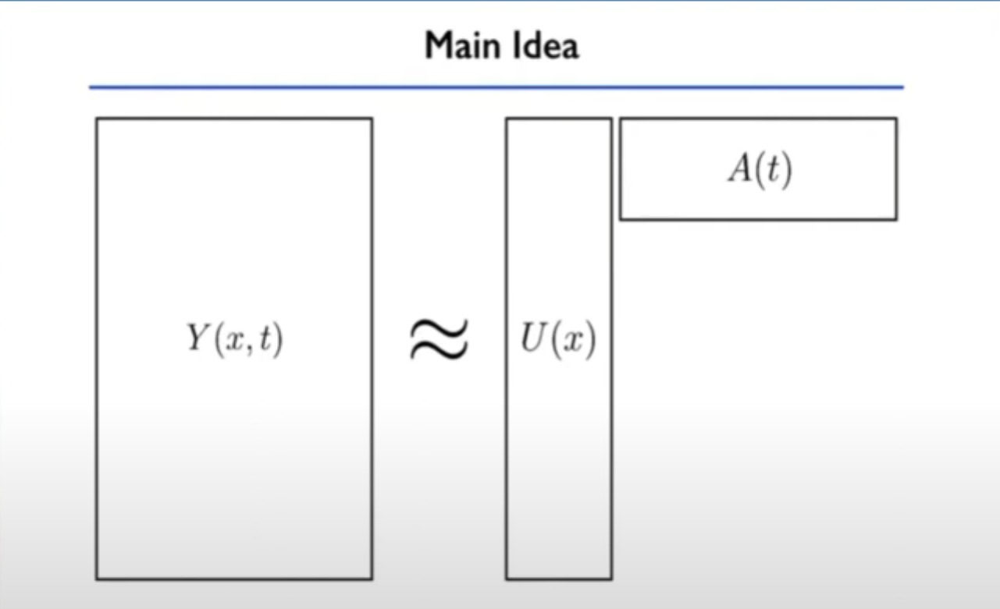
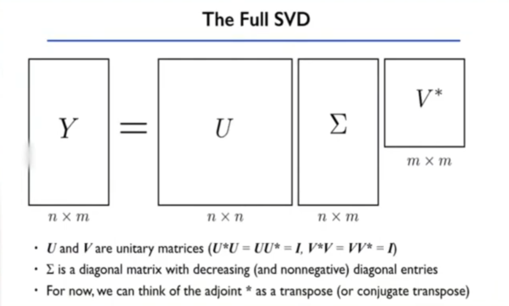
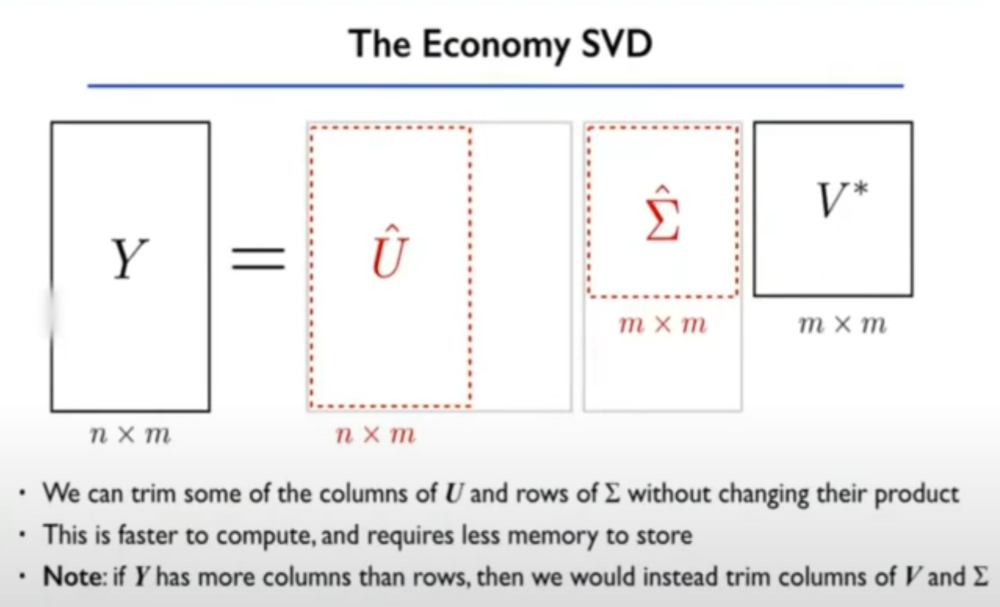
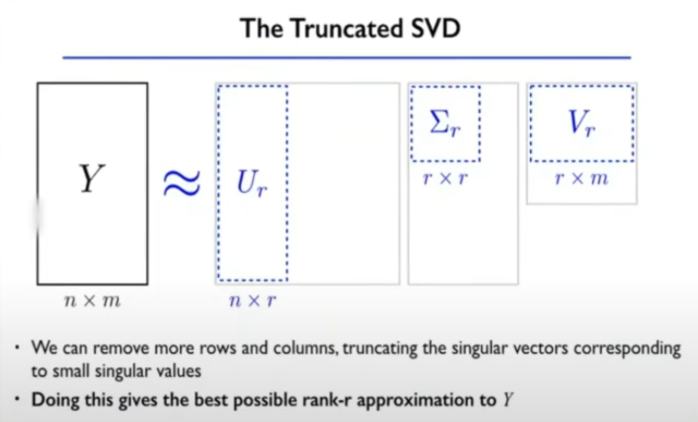
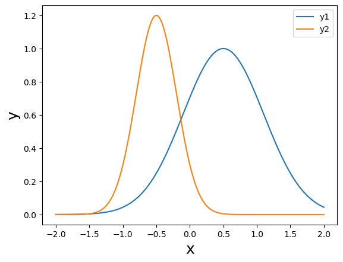
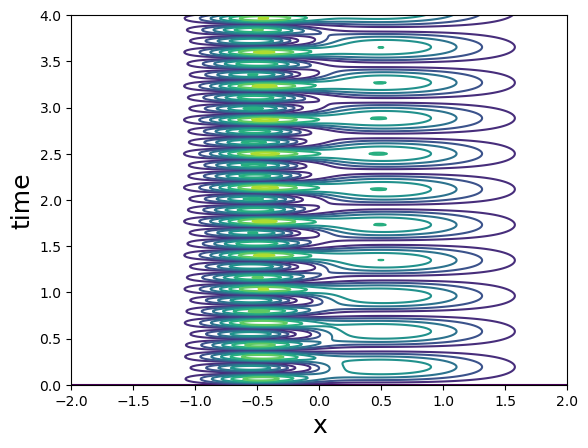
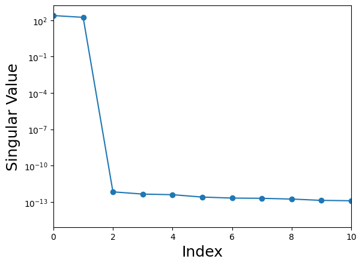
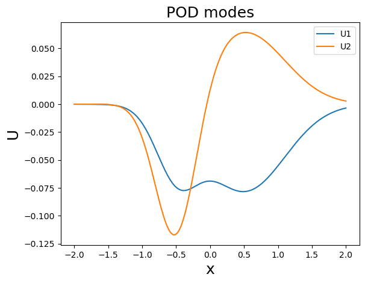
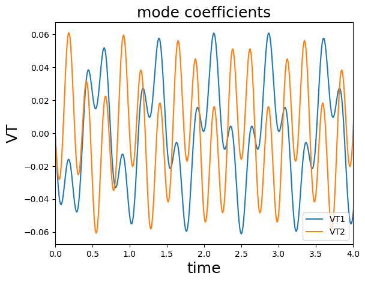

# The Proper Orthogonal Decomposition(POD)
This is an explaination for note.py, the idea is got from https://youtu.be/TcqBbtWTcIc?si=fw05Dq5k5amXK66s.

Suppose we have data that is a fuction of both space and time.
$$y(x,t) = \sum_{m}^{j=1}u_{j}(x)a_{j}(t)$$

Obviously, we can not deal with it easily. If we wanna:
1. to understand the pertinent features present in the data;
2. to store/represent/manipulate the data;
3. to build a reduced-complexity model for the dynamics.

Now, we collect both spatial location and times sets:

$$ 
x: x_{1}, x_{2}, x_{3},..., x_{n}.\\
t: t_{1}, t_{2}, t_{3},..., t_{m}.
$$

We can assemble the data $y(x,t)$ into an $m$ x $n$ matrix:

$$
Y = \begin{bmatrix}
 y(x_{1},t_{1}) & y(x_{1},t_{2}) & \dots  & y(x_{1},t_{m})\\
 y(x_{1},t_{1}) & y(x_{1},t_{2}) & \dots & y(x_{2},t_{m})\\
\vdots  & \vdots  & \ddots & \vdots \\
 y(x_{n},t_{1}) & y(x_{n},t_{2}) & \dots & y(x_{n},t_{m})
\end{bmatrix}
$$

If we measure two components of velocity, $u$ and $v$, the matrix changes as follows:

$$
Y = \begin{bmatrix}
 u(x_{1},t_{1}) & u(x_{1},t_{2}) & \dots & u(x_{1},t_{m})\\
 u(x_{1},t_{1}) & u(x_{1},t_{2}) & \dots & u(x_{2},t_{m})\\
\vdots  & \vdots  & \ddots & \vdots \\
 u(x_{n},t_{1}) & v(x_{n},t_{2}) & \dots & v(x_{n},t_{m})\\
 v(x_{1},t_{1}) & v(x_{1},t_{2}) & \dots & v(x_{1},t_{m})\\
 v(x_{1},t_{1}) & v(x_{1},t_{2}) & \dots & v(x_{2},t_{m})\\
\vdots  & \vdots  & \ddots & \vdots \\
 v(x_{n},t_{1}) & v(x_{n},t_{2}) & \dots & v(x_{n},t_{m})
\end{bmatrix}
$$

If we can use a vector on the left which is only going to be a fuction of space and a vector on right which is only going to be a fuction of time, then the purpose that we wanna get may make sense. Just like the figure as follows.



This can be achieved through a Singular Value Decomposition(SVD):
$$Y = U \Sigma V^{*}$$





Through a code example, it will help us understand better.

```Python
import numpy as np
from numpy import linalg
import matplotlib as mpl
from matplotlib import pyplot as plt

#Define data
x = np.linspace(-2,2,401)
Nx = np.size(x)

amp1 = 1
x01 = 0.5
sigmay1 = 0.6

amp2 = 1.2
x02 = -0.5
sigmay2 = 0.3

dt = 0.01
Nt = 1001
tend = dt*(Nt-1)
t = np.linspace(0,tend,Nt) #time

omega1 = 1.3
omega2 = 4.1

y1 = amp1*np.exp(-((x-x01)**2)/((2*sigmay1**2)))
y2 = amp2*np.exp(-((x-x02)**2)/((2*sigmay2**2)))

Y = np.zeros([Nx,Nt],dtype='d')
for tt in range(Nt):
    Y[:,tt] = y1*np.sin(2*np.pi*omega1*t[tt]) + y2*np.sin(2*np.pi*omega2*t[tt])
U, S, VT = linalg.svd(Y, full_matrices= False)
```

Then we finish the data initialization.

```Python
# show y1 and y2
plt.plot(x,y1,label='y1')
plt.plot(x,y2,label='y2')
plt.xlabel('x', fontsize=18)
plt.ylabel('y', fontsize=18)
plt.legend()
plt.show()
```



```Python
#plt all data
Tgrid, Ygrid = np.meshgrid(t,x)

#contour
plt.contour(Ygrid, Tgrid, np.abs(Y))
plt.xlabel('x', fontsize=18)
plt.ylabel('time', fontsize=18)
plt.ylim(0,4)
plt.show()
```

```Python
plt.semilogy(S,'-o')
plt.xlim(0,10)
plt.ylabel('Singular Value', fontsize=18)
plt.xlabel('Index', fontsize=18)
plt.show()
```

```Python
# x, U
plt.plot(x,U[:,0],label='U1')
plt.plot(x,U[:,1],label='U2')
plt.xlabel('x', fontsize=18)
plt.ylabel('U', fontsize=18)
plt.title('POD modes', fontsize=18)
plt.legend()
plt.show()
```

```Python
# t,VT
plt.plot(t,VT[0,:],label='VT1')
plt.plot(t,VT[1,:],label='VT2')
plt.xlim(0,4)
plt.xlabel('time', fontsize=18)
plt.ylabel('VT', fontsize=18)
plt.title('mode coefficients', fontsize=18)
plt.legend()
plt.show()
```
