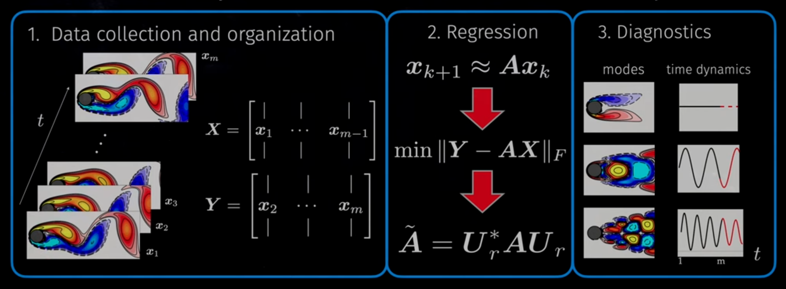
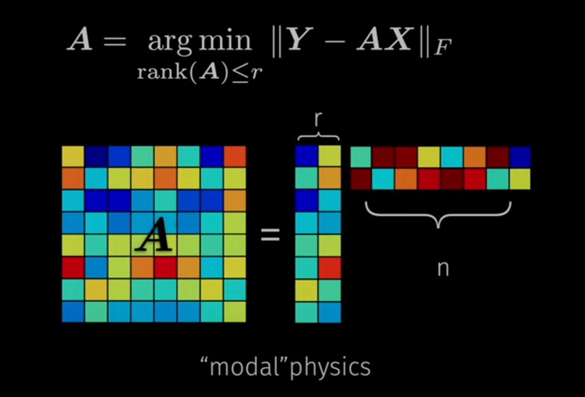
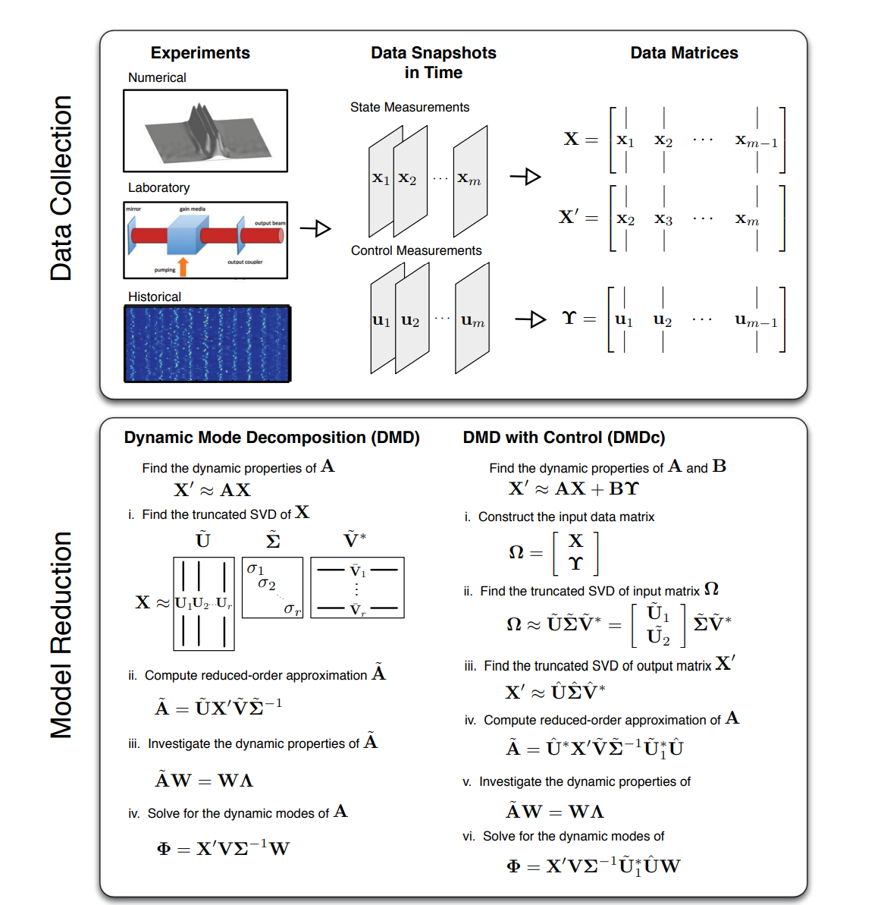

# Dynamic Mode Decomposition

The original website is https://youtu.be/xAYimi7x4Lc?si=f-yYdvbor_Mccq8H and https://www.youtube.com/watch?v=lx-msllg1kU. You can watch it by yourself. This is something comprehended by myself.
And the references are https://arxiv.org/pdf/2112.04307.pdf, https://epubs.siam.org/doi/pdf/10.1137/15M1013857.

Dynamic mode decomposition (DMD) is a powerful data-driven method for analyzing complex systems. Using measurement data from numerical simulations or laboratory experiments, DMD attempts to extract important dynamic characteristics such as unstable growth modes, resonance, and spectral properties. This section provides the mathematical background of DMD.

This is the summary of Dynamic Mode Decomposition(DMD). 

To begin with data collecttion and organization, at a fundamental level, DMD analyzes the relationship between pairs of measurements from a dynamical system.The measurements, $x_k$ and $x_{k+1}$, where $k$ indicates the temporal iteration from a discrete dynamical system, are assumed to be approximately related by a linear operator:

$$
\mathbf{x_{k+1}} \approx  \mathbf{A}\mathbf{x_k},
$$

where $\mathbf{x} ∈ \mathbb{R}^{n}$ and $\mathbf{A} ∈ \mathbb{R}^{n \times n}$. This approximation is assumed to hold for all pairs of measurements. The subsequent description and discussion of DMD will be centered around finding a best-fit solution of the operator A for all pairs of measurements.

Now, we denote the sequence of snapshots collected by the following description:

$$
\mathbf{X} = \begin{bmatrix}
\mid & \mid &  & \mid \\
\mathbf{x_1} & \mathbf{x_2} & \dots  &\mathbf{x_{m-1}} \\
\mid & \mid &  & \mid 
\end{bmatrix}, 
$$

$$
\mathbf{X'} = \begin{bmatrix}
\mid & \mid &  & \mid \\
\mathbf{x_2} & \mathbf{x_3} & \dots  &\mathbf{x_{m}} \\
\mid & \mid &  & \mid 
\end{bmatrix}, 
$$

where $m$ is the total number of snapshots and $\mathbf{X'}$ is the time-shifted snapshot matrix of $\mathbf{X}$, i.e., $\mathbf{X'} = \mathbf{A}\mathbf{X}$. The relationship between pairs of measurement in and the combined data snapshots can be described more compactly in the following matrix form:

$$
\mathbf{X'} \approx \mathbf{A}\mathbf{X},
$$

Solving for an approximation of the process matrix $\mathbf{A}$ for the measurement matrix pair $\mathbf{X}$ and $\mathbf{X'}$ is the primary objective of DMD.

The following section describes how to find the dynamic modes and eigenvalues of the underlying system $\mathbf{A}$. The DMD of the measurement matrix pair $\mathbf{X}$ and $\mathbf{X'}$ is the eigendecomposition of the matrix $\mathbf{A}$. The operator $\mathbf{A}$ is defined by the following:

$$
\mathbf{A} = \mathbf{X'} \mathbf{X}^{-1}
$$

A computationally efficient and accurate method for finding the pseudoinverse is via the SVD. The SVD of $\mathbf{X}$ results in the well-known decomposition.

$$
\begin{aligned}
\mathbf{X}=\mathbf{U} \boldsymbol{\Sigma} \mathbf{V}^{*} & =\left[\begin{array}{cc}
\tilde{\mathbf{U}} & \tilde{\mathbf{U}}_{\mathrm{rem}}
\end{array}\right]\left[\begin{array}{cc}
\tilde{\boldsymbol{\Sigma}} & 0 \\
0 & \boldsymbol{\Sigma}_{\mathrm{rem}}
\end{array}\right]\left[\begin{array}{c}
\tilde{\mathbf{V}}^{*} \\
\tilde{\mathbf{V}}_{\mathrm{rem}}^{*}
\end{array}\right] \\
& \approx \tilde{\mathbf{U}} \tilde{\boldsymbol{\Sigma}} \tilde{\mathbf{V}}^{*}
\end{aligned}
$$

where  $\mathbf{U} \in \mathbb{R}^{n \times n}$, $\boldsymbol{\Sigma} \in \mathbb{R}^{n \times m-1}$, $\tilde{\mathbf{V}}^{*} \in \mathbb{R}^{m-1 \times m-1}$, $\tilde{\mathbf{U}} \in \mathbb{R}^{n \times r}$, $\tilde{\boldsymbol{\Sigma}} \in \mathbb{R}^{r \times r}$, $\tilde{\mathbf{V}}^{*} \in \mathbb{R}^{r \times m-1}$ , rem indicates the remaining $m-1-r$ singular values, and ${ }^{*}$ denotes the complex conjugate transpose.

Using the SVD of the snapshot matrix $\mathbf{X}$, the following approximation of the matrix $\mathbf{A}$ can be computed:

$$
\mathbf{A} \approx \mathbf{\bar{A}} = \mathbf{X'}\tilde{\mathbf{V}} \tilde{\boldsymbol{\Sigma}}^{-1} \tilde{\mathbf{U}}^{*}
$$

where $\mathbf{\bar{A}}$ is an approximation of the operator $\mathbf{A}$. $\mathbf{A}$ dynamic model of the process can be constructed given by the following:

$$
\mathbf{x}_{k+1} =\mathbf{\bar{A}} \mathbf{x}_{k}
$$

If $r \ll n$, a more compact and computationally efficient model can be found by projecting $\mathbf{x_k}$ onto a linear subspace of dimension $r$. This basis transformation takes the form $\mathbf{P}\mathbf{x} = \tilde{\mathbf{x}}$. As previously shown by DMD, a convenient transformation has already been computed via the SVD of $\mathbf{X}$, given by $\mathbf{P} = \tilde{\mathbf{U}}_{*}$. The reduced-order model can be derived as follows:

$$
\begin{aligned}
\tilde{\mathbf{x}}_{k+1} & =\tilde{\mathbf{U}}^{*} \overline{\mathbf{A}} \tilde{\mathbf{U}} \tilde{\mathbf{x}}_{k} \\
& =\tilde{\mathbf{U}}^{*} \mathbf{X}^{\prime} \tilde{\mathbf{V}} \tilde{\mathbf{\Sigma}}^{-1} \tilde{\mathbf{x}}_{k} \\
& =\tilde{\mathbf{A}} \tilde{\mathbf{x}}_{k}
\end{aligned}
$$

The reduced-order model is given by the following:

$$
\tilde{\mathbf{A}} = \tilde{\mathbf{U}}^{*} \mathbf{X}^{\prime} \tilde{\mathbf{V}} \tilde{\mathbf{\Sigma}}^{-1}
$$

As for regression, it is another way to understand the DMD that it seeks a low rank matrix that represent the data. In fact, it can be thought to be a minimization problem, which means that we don't need to understand every single element in matrix A but just the elements in this two column and two rows. Besides, we can improve the memory efficient and do fast computations by the low matrix. ($\mathbf{Y}$ is equal to $\mathbf{X'}$)

$$ \mathbf{A} = \underset{rank(\mathbf{A})\le r}{\arg\min}||\mathbf{Y}-\mathbf{A}\mathbf{X}||_{F} $$

