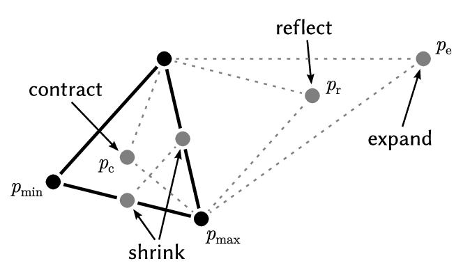
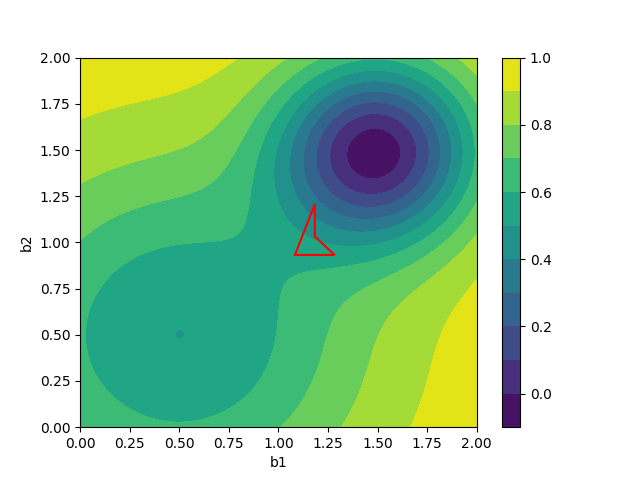

# downhill simplex method
The Nelder–Mead method (also downhill simplex method, amoeba method, or polytope method) is a numerical method used to find the minimum or maximum of an objective function in a multidimensional space. It is a direct search method (based on function comparison) and is often applied to nonlinear optimization problems for which derivatives may not be known. However, the Nelder–Mead technique is a heuristic search method that can converge to non-stationary points on problems that can be solved by alternative methods.

The Nelder–Mead technique was proposed by John Nelder and Roger Mead in 1965, as a development of the method of Spendley et al.

#### One possible variation of the NM algorithm
We are trying to minimize the function $f({\mathbf  x})$, where ${\displaystyle \mathbf {x} \in \mathbb {R} ^{n}}$. Our current test points are ${\displaystyle \mathbf {x} _{1},\ldots ,\mathbf {x} _{n+1}}.$

1. Order 
according to the values at the vertices: ${\displaystyle f(\mathbf {x} _{1})\leq f(\mathbf {x} _{2})\leq \cdots \leq f(\mathbf {x} _{n+1}).}$
Check whether method should stop. See Termination (sometimes called "convergence").

2. Calculate 
${\displaystyle \mathbf {x} _{o}}$, the centroid of all points except ${\displaystyle \mathbf {x} _{n+1}}.$

3. Reflection
Compute reflected point ${\displaystyle \mathbf {x} _{r}=\mathbf {x} _{o}+\alpha (\mathbf {x} _{o}-\mathbf {x} _{n+1})}$ with $\alpha >0.$
If the reflected point is better than the second worst, but not better than the best, i.e. ${\displaystyle f(\mathbf {x} _{1})\leq f(\mathbf {x} _{r})<f(\mathbf {x} _{n})},$ then obtain a new simplex by replacing the worst point ${\displaystyle \mathbf {x} _{n+1}}$ with the reflected point ${\displaystyle \mathbf {x} _{r}},$ and go to step 1.

4. Expansion
If the reflected point is the best point so far, ${\displaystyle f(\mathbf {x} _{r})<f(\mathbf {x} _{1})},$ then compute the expanded point ${\displaystyle \mathbf {x} _{e}=\mathbf {x} _{o}+\gamma (\mathbf {x} _{r}-\mathbf {x} _{o})}$ with $\gamma >1.$
If the expanded point is better than the reflected point, ${\displaystyle f(\mathbf {x} _{e})<f(\mathbf {x} _{r})},$then obtain a new simplex by replacing the worst point ${\displaystyle \mathbf {x} _{n+1}}$ with the expanded point ${\displaystyle \mathbf {x} _{e}}$ and go to step 1;
else obtain a new simplex by replacing the worst point ${\displaystyle \mathbf {x} _{n+1}}$ with the reflected point ${\displaystyle \mathbf {x} _{r}}$ and go to step 1.

5. Contraction
Here it is certain that ${\displaystyle f(\mathbf {x} _{r})\geq f(\mathbf {x} _{n})}$. (Note that ${\displaystyle \mathbf {x} _{n}}$ is second or "next" to the worst point.)
If ${\displaystyle f(\mathbf {x} _{r})<f(\mathbf {x} _{n+1})},$ then compute the contracted point on the outside ${\displaystyle \mathbf {x} _{c}=\mathbf {x} _{o}+\rho (\mathbf {x} _{r}-\mathbf {x} _{o})}$ with ${\displaystyle 0<\rho \leq 0.5}.$ 
If the contracted point is better than the reflected point, i.e. ${\displaystyle f(\mathbf {x} _{c})<f(\mathbf {x} _{r})},$ then obtain a new simplex by replacing the worst point ${\displaystyle \mathbf {x} _{n+1}}$ with the contracted point ${\displaystyle \mathbf {x} _{c}}$ and go to step 1;
Else go to step 6;
If ${\displaystyle f(\mathbf {x} _{r})\geq f(\mathbf {x} _{n+1})},$ then compute the contracted point on the inside ${\displaystyle \mathbf {x} _{c}=\mathbf {x} _{o}+\rho (\mathbf {x} _{n+1}-\mathbf {x} _{o})}$ with ${\displaystyle 0<\rho \leq 0.5}.$
If the contracted point is better than the worst point, i.e. 
${\displaystyle f(\mathbf {x} _{c})<f(\mathbf {x} _{n+1})},$
then obtain a new simplex by replacing the worst point ${\displaystyle \mathbf {x} _{n+1}}$ with the contracted point ${\displaystyle \mathbf {x} _{c}}$ and go to step 1;
Else go to step 6;

6. Shrink
Replace all points except the best $({\displaystyle \mathbf {x} _{1}})$ with ${\displaystyle \mathbf {x} _{i}=\mathbf {x} _{1}+\sigma (\mathbf {x} _{i}-\mathbf {x} _{1})}$ and go to step 1.

Note:$\alpha$, $\gamma$, $\rho$ and $\sigma$  are respectively the reflection, expansion, contraction and shrink coefficients. Standard values are $\alpha =1$, $\gamma = 2$, ${\displaystyle \rho =1/2}$ and ${\displaystyle \sigma =1/2}.$

Like:

To:

